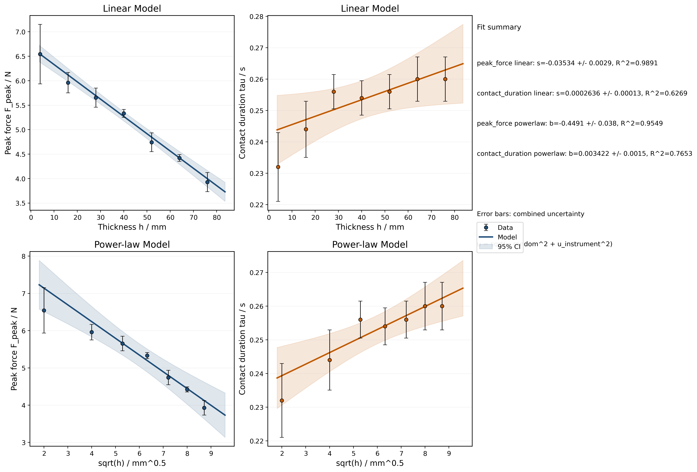

### Investigating Impact Attenuation Through Variable-Thickness Viscoelastic Pads

This project analyzes force–time traces from impact tests on viscoelastic pads of varying thickness to quantify how thickness affects impact attenuation. The pipeline computes contact durations, extracts summary metrics (e.g., peak force), fits statistical models, and generates publication-ready figures, tables, and reports.

[](batch/outputs/batch_analysis_plot.png)

> [!NOTE]
> This repository contains the source code and data for my IBDP Physics HL Internal Assessment (IA). It is not intended for public use; feel free to explore for educational purposes.

#### Install

```bash
git clone https://github.com/cytronicoder/spongebobs-corpse.git
cd spongebobs-corpse
python3 -m venv .venv
source .venv/bin/activate
pip install -e .
```

For development tools (lint/tests):

```bash
pip install -e .[dev]
```

#### Run the analysis pipeline

```bash
python -m spongebobs_corpse pipeline run-batch --input batch/data.csv --out batch/outputs
```

Equivalent console script:

```bash
spongebobs-corpse run --input batch/data.csv --out batch/outputs
```

#### Reproducibility and parity check

Regenerate all outputs, then verify against the expected manifest:

```bash
python -m spongebobs_corpse pipeline run-batch --input batch/data.csv --out batch/outputs
python tools/verify_outputs.py --manifest batch/outputs/manifest_expected.json --repo-root .
```

This produces:

- publication figures (`.png` + `.pdf`) and caption sidecars (`*_caption.txt`)
- model tables and residual diagnostics
- statistical reports
- legacy-compatible batch artifacts (manifest-checked)

#### Output structure

- `batch/outputs/` — canonical outputs (figures, tables, reports)
- `batch/outputs/final/` — publication copies of final figures (if enabled by pipeline)
- `batch/` — legacy-compatible top-level deliverables retained for parity

Caption sidecars are written as:

- `<stem>_caption.txt`

#### Generated outputs

- `batch/outputs/batch_analysis_plot.png` — Multi-panel model comparison for `F_peak` and `tau` (PDF: `batch/outputs/batch_analysis_plot.pdf`)
- `batch/outputs/batch_cv_plot.png` — Coefficient of variation by thickness (PDF: `batch/outputs/batch_cv_plot.pdf`)
- `batch/outputs/residual_plots.png` — Residual diagnostics for fitted models (PDF: `batch/outputs/residual_plots.pdf`)
- `batch/outputs/ANALYSIS_SUMMARY.txt`
- `batch/outputs/statistical_report.txt`
- `batch/outputs/model_comparison.txt`
- `batch/outputs/additional_statistics.txt`
- `batch/outputs/model_parameters.csv`
- `batch/outputs/model_residuals.csv`
- `batch/outputs/pairwise_comparisons.csv`
- `batch/outputs/batch_detailed.csv`
- `batch/outputs/batch_summary.csv`
- `batch/outputs/summary_table_formatted.csv`

Notes on compatibility:

- Legacy top-level `batch/*` deliverables have been removed from the pipeline; the canonical outputs are under `batch/outputs/` and the manifest reflects that.

#### Documentation

Documentation is in `docs/`:

- `docs/getting-started.md` — installation and usage
- `docs/api-reference.md` — API reference
- `docs/analysis-methods.md` — mathematical/physical methods
- `docs/statistical-methods.md` — inference and uncertainty quantification
- `docs/troubleshooting.md` — common issues

#### Quality gates

```bash
ruff check .
pytest
```

#### Requirements

- Python 3.8+
- numpy
- pandas
- matplotlib
- scipy

#### License

MIT. See [`LICENSE`](LICENSE) for details.
